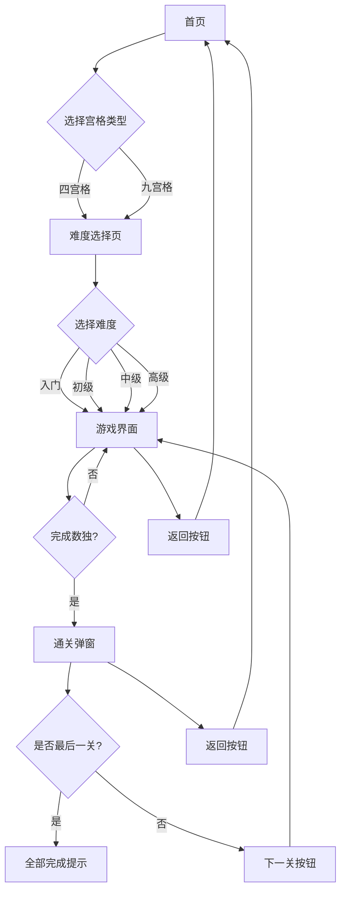

## 1. Product Overview
四宫格和九宫格数独小游戏，支持4个难度等级，每个等级25个关卡，可在桌面和移动浏览器中使用。
- 提供经典数独游戏体验，包含四宫格(4x4)和九宫格(9x9)两种模式
- 目标用户：数独爱好者、休闲游戏玩家

## 2. Core Features

### 2.1 Feature Module
1. **首页**: 选择宫格类型（四宫格/九宫格）
2. **难度选择页**: 选择难度等级（入门、初级、中级、高级）
3. **游戏界面**: 数独棋盘、数字选择器、计时器、返回按钮
4. **通关弹窗**: 祝贺提示、下一关按钮

### 2.2 Page Details
| Page Name | Module Name | Feature description |
|-----------|-------------|---------------------|
| 首页 | 宫格选择 | 显示四宫格和九宫格两个卡片，点击进入难度选择 |
| 难度选择页 | 难度卡片 | 显示4个难度等级卡片（入门、初级、中级、高级），点击开始游戏 |
| 游戏界面 | 数独棋盘 | 根据选择生成对应大小的数独棋盘，支持点击填数 |
| 游戏界面 | 数字选择器 | 底部数字键盘，点击选择数字填入格子 |
| 游戏界面 | 计时器 | 显示当前关卡用时 |
| 游戏界面 | 返回按钮 | 返回首页重新选择 |
| 通关弹窗 | 祝贺提示 | 显示"恭喜通关"，展示用时和关卡信息 |
| 通关弹窗 | 下一关按钮 | 点击进入下一关，第25关显示完成提示 |

## 3. Core Process
用户进入首页 → 选择四宫格或九宫格 → 选择难度等级 → 进入游戏界面 → 完成数独 → 弹出通关提示 → 点击下一关/返回

## 4. User Interface Design

### 4.1 Design Style
- 主色调：深蓝色(#1e3a5f)配合白色背景
- 按钮风格：圆角矩形，悬停有阴影效果
- 字体：简洁现代的无衬线字体
- 布局：卡片式布局，清晰的视觉层次
- 响应式设计：适配桌面和移动设备

### 4.2 Page Design Overview
| Page Name | Module Name | UI Elements |
|-----------|-------------|-------------|
| 首页 | 宫格选择卡片 | 两个大卡片，显示4x4和9x9网格预览，卡片式布局，间距适中 |
| 难度选择页 | 难度卡片 | 四个卡片排成网格，颜色区分难度，从绿色(入门)到红色(高级) |
| 游戏界面 | 数独棋盘 | 网格布局，粗线分隔宫格，选中格子高亮 |
| 游戏界面 | 数字选择器 | 底部横向排列的数字按钮，点击选中状态 |
| 游戏界面 | 计时器 | 顶部居中显示，数字风格 |
| 通关弹窗 | 模态框 | 居中显示，半透明背景遮罩 |

### 4.3 Responsiveness
- 桌面端：完整显示所有元素，棋盘较大
- 移动端：自适应布局，棋盘缩小，数字按钮调整大小，支持触摸操作

### 4.4 难度等级说明
| 难度 | 移除数字比例 | 特征 |
|------|-------------|------|
| 入门 | 30% | 简单，适合初学者 |
| 初级 | 45% | 适中，需要基本技巧 |
| 中级 | 60% | 较难，需要进阶技巧 |
| 高级 | 75% | 困难，需要高级技巧 |

### 4.5 关卡设置
- 每个难度等级25个关卡
- 关卡按顺序解锁，完成当前关卡才能进入下一关
- 本地存储记录已完成关卡进度

## 5. Technical Requirements
- 纯前端实现，无需后端
- 支持Windows和手机浏览器
- 使用React + TypeScript + Tailwind CSS
- 响应式设计，适配不同屏幕尺寸