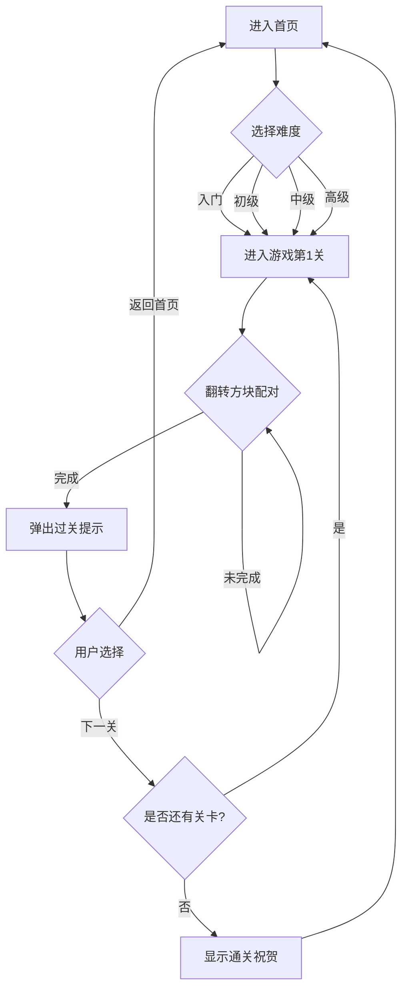

## 1. Product Overview
一款四宫格记忆配对小游戏，用户通过选择难度等级开始游戏，在限定时间或步数内找出所有配对的方块。目标用户为休闲游戏爱好者，提供轻松有趣的脑力锻炼体验。

## 2. Core Features

### 2.1 User Roles
| Role | Registration Method | Core Permissions |
|------|---------------------|------------------|
| Player | 无需注册 | 选择难度、游玩关卡、查看进度 |

### 2.2 Feature Module
1. **首页**: 难度选择（入门、初级、中级、高级）
2. **游戏页**: 四宫格游戏界面、计时器、步数统计、返回按钮
3. **过关弹窗**: 祝贺提示、下一关按钮

### 2.3 Page Details
| Page Name | Module Name | Feature description |
|-----------|-------------|---------------------|
| 首页 | 难度选择 | 4个难度等级卡片，点击进入对应难度游戏 |
| 游戏页 | 游戏区域 | 四宫格方块布局，点击翻转方块进行配对 |
| 游戏页 | 状态栏 | 显示当前关卡、难度、计时器、步数 |
| 游戏页 | 返回按钮 | 点击返回首页重新选择难度 |
| 过关弹窗 | 祝贺提示 | 显示过关信息和下一关按钮 |

## 3. Core Process
用户进入首页 → 选择难度等级 → 进入游戏界面 → 翻转方块配对 → 完成所有配对 → 弹出过关提示 → 点击下一关继续或返回首页

## 4. User Interface Design

### 4.1 Design Style
- **主色调**: 清新渐变蓝紫色 (#667eea → #764ba2)
- **次色调**: 明亮橙色 (#f093fb → #f5576c) 作为强调色
- **按钮风格**: 圆角卡片式，带渐变背景和阴影效果
- **字体**: 使用现代无衬线字体，标题加粗
- **布局风格**: 卡片式布局，居中对齐
- **动画效果**: 方块翻转动画、配对成功闪烁效果

### 4.2 Page Design Overview

| Page Name | Module Name | UI Elements |
|-----------|-------------|-------------|
| 首页 | 标题区域 | 游戏名称、副标题 |
| 首页 | 难度选择 | 4个难度卡片，显示难度名称和描述 |
| 游戏页 | 状态栏 | 当前关卡、难度等级、计时器、步数 |
| 游戏页 | 游戏区域 | 四宫格/更多格子的方块矩阵 |
| 游戏页 | 返回按钮 | 左上角返回图标按钮 |
| 过关弹窗 | 弹窗内容 | 祝贺图标、过关信息、下一关按钮 |

### 4.3 Responsiveness
- **桌面端**: 游戏区域居中，方块大小适中
- **移动端**: 响应式布局，方块尺寸适配屏幕，支持触摸操作

## 5. Difficulty Settings

| 难度 | 网格大小 | 配对数量 | 时间限制 | 描述 |
|------|----------|----------|----------|------|
| 入门 | 2x2 | 2对 | 无限制 | 适合新手 |
| 初级 | 3x3 | 4对 | 60秒 | 稍有挑战 |
| 中级 | 4x4 | 8对 | 90秒 | 需要策略 |
| 高级 | 5x5 | 12对 | 120秒 | 高难度挑战 |

## 6. Level Structure
- 每个难度包含25个关卡
- 关卡递进：配对顺序随机，每关重新生成
- 完成当前关卡后解锁下一关
- 关卡进度使用本地存储保存