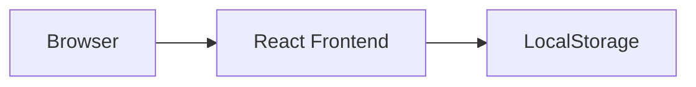
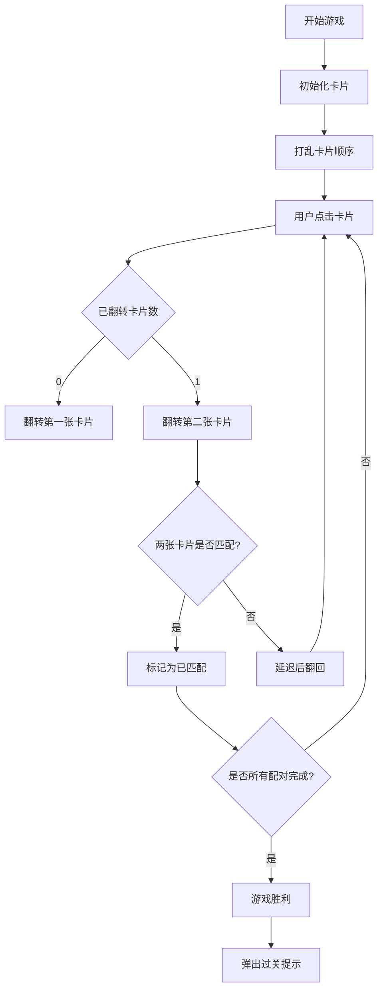

## 1. Architecture Design



## 2. Technology Description
- Frontend: React@18 + tailwindcss@3 + vite
- Initialization Tool: vite-init (react-ts template)
- Backend: None (纯前端应用，使用本地存储保存进度)
- State Management: Zustand

## 3. Route Definitions
| Route | Purpose |
|-------|---------|
| / | 首页，难度选择页面 |
| /game/:difficulty/:level | 游戏页面，根据难度和关卡加载 |

## 4. State Management Schema

### 4.1 Game State
```typescript
interface GameState {
  currentDifficulty: Difficulty | null;
  currentLevel: number;
  isPlaying: boolean;
  isGameOver: boolean;
  isWin: boolean;
  matchedPairs: number;
  totalPairs: number;
  steps: number;
  timeRemaining: number;
  cards: Card[];
  flippedCards: number[];
}
```

### 4.2 Card Interface
```typescript
interface Card {
  id: number;
  value: string;
  isFlipped: boolean;
  isMatched: boolean;
}
```

### 4.3 Difficulty Configuration
```typescript
type Difficulty = 'easy' | 'basic' | 'intermediate' | 'advanced';

interface DifficultyConfig {
  key: Difficulty;
  name: string;
  gridSize: number;
  pairsCount: number;
  timeLimit: number; // 秒，0表示无限制
  description: string;
}
```

## 5. Component Structure

```
src/
├── components/
│   ├── Card.tsx          # 单个方块组件
│   ├── GameBoard.tsx     # 游戏面板
│   ├── DifficultyCard.tsx # 难度选择卡片
│   ├── StatusBar.tsx     # 状态栏
│   ├── WinModal.tsx      # 过关弹窗
│   └── Timer.tsx         # 计时器组件
├── pages/
│   ├── HomePage.tsx      # 首页
│   └── GamePage.tsx      # 游戏页
├── stores/
│   └── gameStore.ts      # Zustand状态管理
├── utils/
│   ├── gameLogic.ts      # 游戏逻辑工具
│   └── storage.ts        # 本地存储工具
├── types/
│   └── index.ts          # 类型定义
└── App.tsx               # 应用入口
```

## 6. Data Model

### 6.1 LocalStorage Schema
```typescript
interface GameProgress {
  [difficulty: string]: {
    unlockedLevel: number;
    completedLevels: number[];
  };
}
```

### 6.2 Emoji Icons for Cards
使用emoji作为卡片图案，涵盖多种类别：
- 动物类: 🐶, 🱃, 🐱, 🦁, 🐯, 🐼, 🐨, 🐸
- 水果类: 🍎, 🍊, 🍋, 🍇, 🍓, 🍑, 🍒, 🥝
- 交通工具: 🚗, 🚀, ✈️, 🚢, 🚲, 🚂, 🚁, 🚤
- 物品类: ⚽, 🏀, 🎸, 🎨, 📚, 💎, 🔑, 🎁

## 7. Game Logic Flow



## 8. Development Guidelines
- 使用React Hooks管理组件状态
- 使用Zustand管理全局游戏状态
- 使用Tailwind CSS进行样式设计
- 使用CSS动画实现方块翻转效果
- 使用setInterval实现计时器
- 使用localStorage保存游戏进度