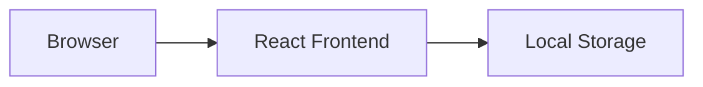
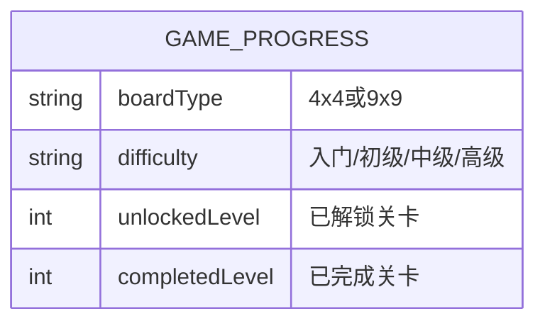

## 1. Architecture Design


- 纯前端架构，无后端服务
- 使用React组件化开发
- LocalStorage存储游戏进度

## 2. Technology Description
- Frontend: React@18 + TypeScript + tailwindcss@3 + vite
- Initialization Tool: vite-init
- Backend: None
- Database: LocalStorage

## 3. Route Definitions
| Route | Purpose |
|-------|---------|
| / | 首页，选择宫格类型 |
| /difficulty | 难度选择页 |
| /game | 游戏界面 |

## 4. API Definitions
无后端API，所有逻辑在前端实现

## 5. Data Model
### 5.1 Data Model Definition


### 5.2 LocalStorage Key Structure
| Key | Value Type | Description |
|-----|-----------|-------------|
| sudoku_progress_4x4_easy | JSON | 四宫格入门进度 |
| sudoku_progress_4x4_normal | JSON | 四宫格初级进度 |
| sudoku_progress_4x4_medium | JSON | 四宫格中级进度 |
| sudoku_progress_4x4_hard | JSON | 四宫格高级进度 |
| sudoku_progress_9x9_easy | JSON | 九宫格入门进度 |
| sudoku_progress_9x9_normal | JSON | 九宫格初级进度 |
| sudoku_progress_9x9_medium | JSON | 九宫格中级进度 |
| sudoku_progress_9x9_hard | JSON | 九宫格高级进度 |

## 6. Component Structure
```
src/
├── components/
│   ├── GridCard.tsx          # 宫格选择卡片
│   ├── DifficultyCard.tsx    # 难度选择卡片
│   ├── SudokuBoard.tsx       # 数独棋盘
│   ├── NumberPad.tsx         # 数字键盘
│   ├── Timer.tsx             # 计时器
│   ├── VictoryModal.tsx      # 通关弹窗
│   └── BackButton.tsx        # 返回按钮
├── pages/
│   ├── Home.tsx              # 首页
│   ├── DifficultySelect.tsx  # 难度选择页
│   └── Game.tsx              # 游戏页面
├── utils/
│   ├── sudokuGenerator.ts    # 数独生成器
│   ├── sudokuSolver.ts       # 数独求解器
│   └── storage.ts            # 本地存储工具
├── types/
│   └── index.ts              # 类型定义
├── store/
│   └── gameStore.ts          # 游戏状态管理
├── App.tsx
├── main.tsx
└── index.css
```

## 7. Core Logic
### 7.1 数独生成算法
1. 使用回溯算法生成完整的数独解
2. 根据难度等级移除一定比例的数字
3. 确保移除后谜题有唯一解

### 7.2 游戏状态管理
- 棋盘数据（当前值、原始值、是否可编辑）
- 选中格子位置
- 当前关卡
- 计时器状态

### 7.3 通关检测
- 检测每行是否包含1-N的所有数字
- 检测每列是否包含1-N的所有数字
- 检测每个宫格是否包含1-N的所有数字
- 检测所有格子是否填满

## 8. Styling
- 使用Tailwind CSS进行样式开发
- 响应式设计，适配桌面和移动端
- 深色主题配合明亮的高亮色